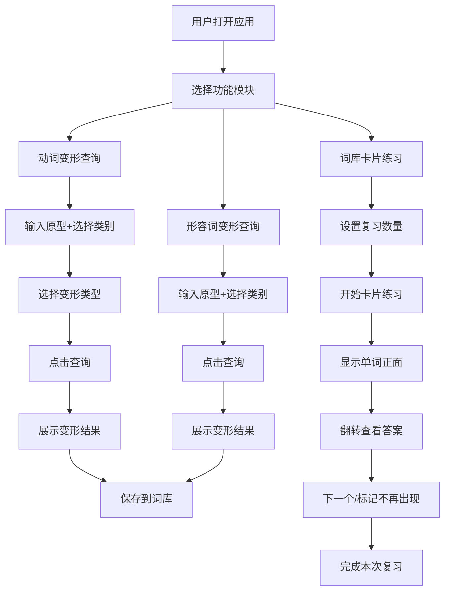

## 1. 产品概述

日语动词形容词学习软件，帮助中国日语学习者掌握日语动词和形容词的各种变形规则，通过卡片式复习巩固记忆。

- 主要面向日语学习者，解决动词变形规则复杂难记的问题
- 通过输入查询、词库积累、卡片复习三大功能，形成完整的学习闭环

## 2. 核心功能

### 2.1 功能模块

1. **动词变形查询**：输入动词原型和类别，查询各种变形结果
2. **形容词变形查询**：输入形容词原型和类别，查询各种变形结果
3. **词库管理**：自动保存查询过的词汇，支持浏览和管理
4. **卡片练习**：以卡片形式复习词库中的词汇，支持上一个/下一个/不再出现操作
5. **复习设置**：设置每次复习的单词数量

### 2.2 页面详情

| 页面名称 | 模块名称 | 功能描述 |
|-----------|-------------|---------------------|
| 首页 | 导航栏 | 切换动词/形容词/词库练习页面 |
| 动词变形页 | 输入区域 | 输入动词原型，选择动词类别（一类/二类/三类） |
| 动词变形页 | 变形选择 | 下拉选择需要输出的变形类型，支持多选 |
| 动词变形页 | 结果展示 | 展示选中的变形结果，支持一键加入词库 |
| 形容词变形页 | 输入区域 | 输入形容词原型，选择形容词类别（1类/2类） |
| 形容词变形页 | 结果展示 | 展示过去式、ば形、名词化结果 |
| 词库练习页 | 卡片展示 | 翻转卡片查看答案，上一个/下一个导航 |
| 词库练习页 | 复习设置 | 设置每次复习的单词数量 |
| 词库练习页 | 管理操作 | 标记"不再出现"，从词库中移除 |

## 3. 核心流程

## 4. 用户界面设计

### 4.1 设计风格

- 主色调：深蓝色（#1E3A5F）代表学习的沉稳感
- 辅助色：樱花粉（#FFB7C5）作为强调色，呼应日本文化元素
- 中性色：米白色背景（#FAF8F5），深灰色文字（#2C3E50）
- 按钮风格：圆角矩形，轻微阴影，hover 时有颜色过渡动画
- 字体：使用 "Noto Sans SC" 中文显示字体，日语部分使用系统日语字体
- 布局风格：卡片式布局，顶部导航，内容区域居中
- 图标：使用简洁的线性图标，搭配少量日语假名装饰元素

### 4.2 页面设计概览

| 页面名称 | 模块名称 | UI 元素 |
|-----------|-------------|-------------|
| 首页 | 导航栏 | 标签页切换、当前选中状态高亮 |
| 动词变形页 | 输入区域 | 文本输入框、下拉选择框、查询按钮 |
| 动词变形页 | 变形选择 | 多选下拉框，默认选中"基本型过去式"和"动词基本型的否定" |
| 动词变形页 | 结果卡片 | 网格布局展示变形结果，每个结果有复制按钮 |
| 形容词变形页 | 输入区域 | 类似动词页面，类别选择为1类/2类形容词 |
| 形容词变形页 | 结果展示 | 三个结果卡片并排展示 |
| 词库练习页 | 设置区域 | 数字输入框设置复习数量，开始按钮 |
| 词库练习页 | 卡片区域 | 大卡片居中，3D翻转效果显示答案 |
| 词库练习页 | 控制按钮 | 上一个、下一个、不再出现、翻转按钮 |

### 4.3 响应式设计

- 桌面端优先，内容最大宽度 1200px 居中显示
- 平板端：卡片数量自适应，导航保持顶部
- 移动端：导航转为底部标签栏，卡片单列布局，按钮尺寸适配触控
- 所有表单元素支持键盘操作和屏幕阅读器

### 4.4 动画效果

- 页面切换：淡入淡出过渡
- 卡片翻转：CSS 3D transform 实现翻转动画
- 按钮点击：轻微缩放反馈
- 结果加载：骨架屏占位
- 输入验证错误：抖动动画提示
