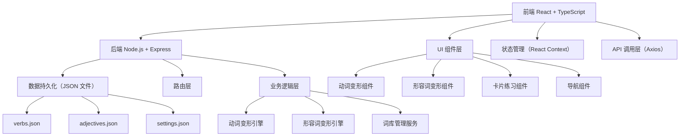
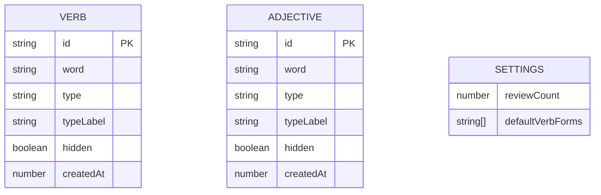
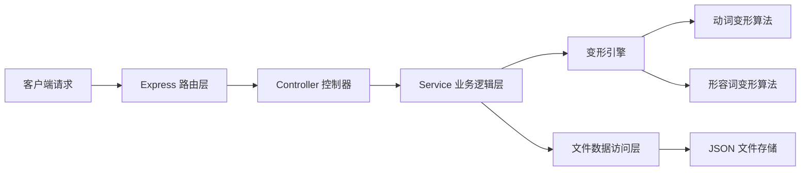

## 1. 架构设计



## 2. 技术描述

- **前端**：React@18 + TypeScript + Vite + TailwindCSS@3 + React Router
- **初始化工具**：Vite 脚手架
- **后端**：Node.js + Express@4 + TypeScript
- **数据持久化**：本地 JSON 文件存储（无需数据库）
- **状态管理**：React Context + useReducer
- **HTTP 客户端**：Axios
- **图标库**：Lucide React

## 3. 项目结构

```
test1/
├── client/                    # 前端项目
│   ├── src/
│   │   ├── components/       # 公共组件
│   │   ├── pages/            # 页面组件
│   │   │   ├── VerbPage.tsx
│   │   │   ├── AdjectivePage.tsx
│   │   │   └── PracticePage.tsx
│   │   ├── context/          # 状态管理
│   │   ├── services/         # API 服务
│   │   ├── types/            # 类型定义
│   │   ├── utils/            # 工具函数
│   │   ├── App.tsx
│   │   └── main.tsx
│   ├── package.json
│   └── vite.config.ts
├── server/                    # 后端项目
│   ├── src/
│   │   ├── controllers/      # 控制器
│   │   ├── services/         # 业务逻辑
│   │   │   ├── verbConjugation.ts
│   │   │   └── adjectiveConjugation.ts
│   │   ├── models/           # 数据模型
│   │   ├── routes/           # 路由
│   │   ├── data/             # JSON 数据文件
│   │   └── index.ts
│   ├── package.json
│   └── tsconfig.json
├── README.md
└── package.json               # 根目录 package.json（管理两个子项目）
```

## 4. 路由定义

### 前端路由

| 路由 | 页面 | 说明 |
|-------|------|------|
| / | 动词变形页 | 默认页面 |
| /adjective | 形容词变形页 | 形容词变形查询 |
| /practice | 卡片练习页 | 词库复习 |

### 后端 API 路由

| 方法 | 路由 | 说明 |
|------|------|------|
| POST | /api/verb/conjugate | 动词变形查询 |
| POST | /api/adjective/conjugate | 形容词变形查询 |
| GET | /api/verbs | 获取所有动词词库 |
| POST | /api/verbs | 新增动词到词库 |
| DELETE | /api/verbs/:id | 删除动词 |
| PATCH | /api/verbs/:id/hide | 标记动词不再出现 |
| GET | /api/adjectives | 获取所有形容词词库 |
| POST | /api/adjectives | 新增形容词到词库 |
| DELETE | /api/adjectives/:id | 删除形容词 |
| PATCH | /api/adjectives/:id/hide | 标记形容词不再出现 |
| GET | /api/settings | 获取设置 |
| PUT | /api/settings | 更新设置 |

## 5. API 定义

### 类型定义

```typescript
// 动词类型
type VerbType = 'ichidan' | 'godan' | 'irregular'; // 二类、一类、三类

// 形容词类型
type AdjectiveType = 'i' | 'na'; // 1类、2类

// 变形类型
type VerbFormType = 
  | 'past'           // 基本型过去式
  | 'negative'       // 基本型否定
  | 'pastNegative'   // 基本型过去否定
  | 'teForm'         // て形
  | 'renyoukei'      // 连用形
  | 'passive'        // 被动形式
  | 'causative'      // 使役形式
  | 'imperative'     // 命令形
  | 'potential'      // 可能性
  | 'volitional'     // 意志性
  | 'masuForm';      // ます形

type AdjectiveFormType =
  | 'past'           // 过去式
  | 'baForm'         // ば形
  | 'nominalization'; // 名词化

// 动词实体
interface Verb {
  id: string;
  word: string;          // 原型
  type: VerbType;
  typeLabel: string;     // 中文类别标签
  hidden: boolean;       // 是否不再出现
  createdAt: number;
}

// 形容词实体
interface Adjective {
  id: string;
  word: string;          // 原型
  type: AdjectiveType;
  typeLabel: string;     // 中文类别标签
  hidden: boolean;       // 是否不再出现
  createdAt: number;
}

// 设置
interface Settings {
  reviewCount: number;   // 每次复习数量
  defaultVerbForms: VerbFormType[]; // 默认选中的变形
}

// 请求/响应
interface VerbConjugateRequest {
  word: string;
  type: VerbType;
  forms: VerbFormType[];
}

interface VerbConjugateResponse {
  word: string;
  type: VerbType;
  results: {
    formType: VerbFormType;
    formLabel: string;
    value: string;
  }[];
}

interface AdjectiveConjugateRequest {
  word: string;
  type: AdjectiveType;
}

interface AdjectiveConjugateResponse {
  word: string;
  type: AdjectiveType;
  results: {
    formType: AdjectiveFormType;
    formLabel: string;
    value: string;
  }[];
}
```

## 6. 数据模型

### 6.1 数据模型 ER 图



### 6.2 数据文件结构

**verbs.json**
```json
[
  {
    "id": "uuid-1",
    "word": "食べる",
    "type": "ichidan",
    "typeLabel": "二类动词",
    "hidden": false,
    "createdAt": 1234567890
  }
]
```

**adjectives.json**
```json
[
  {
    "id": "uuid-1",
    "word": "高い",
    "type": "i",
    "typeLabel": "1类形容词",
    "hidden": false,
    "createdAt": 1234567890
  }
]
```

**settings.json**
```json
{
  "reviewCount": 10,
  "defaultVerbForms": ["past", "negative"]
}
```

## 7. 核心算法说明

### 动词变形规则

1. **一类动词（五段动词）**：
   - ます形：词尾う段 → い段 + ます
   - て形：词尾つ/う/る → って；く/ぐ → いて/いで；む/ぶ/ぬ → んで；す → して
   - ない形：词尾う段 → あ段 + ない（う → わ）
   - 过去式：同て形规则，て→た，で→だ
   - 假定形：词尾う段 → え段 + ば
   - 意志形：词尾う段 → お段 + う
   - 可能形：词尾う段 → え段 + る
   - 被动形：词尾う段 → あ段 + れる
   - 使役形：词尾う段 → あ段 + せる
   - 命令形：词尾う段 → え段

2. **二类动词（一段动词）**：
   - ます形：去掉る + ます
   - て形：去掉る + て
   - ない形：去掉る + ない
   - 过去式：去掉る + た
   - 假定形：去掉る + れば
   - 意志形：去掉る + よう
   - 可能形：去掉る + られる
   - 被动形：去掉る + られる
   - 使役形：去掉る + させる
   - 命令形：去掉る + ろ

3. **三类动词（不规则）**：
   - カ变：来る（くる）→ 来ます（きます）、来て（きて）、来ない（こない）等
   - サ变：する → します、して、しない等；名词+する → 名词+します等

### 形容词变形规则

1. **1类形容词（い形容词）**：
   - 过去式：去掉い + かった
   - ば形：去掉い + ければ
   - 名词化：去掉い + さ / み

2. **2类形容词（な形容词）**：
   - 过去式：去掉な + だった（词干 + だった）
   - ば形：去掉な + なら（词干 + なら）
   - 名词化：词干 + さ / み（部分形容词）

## 8. 服务器架构


